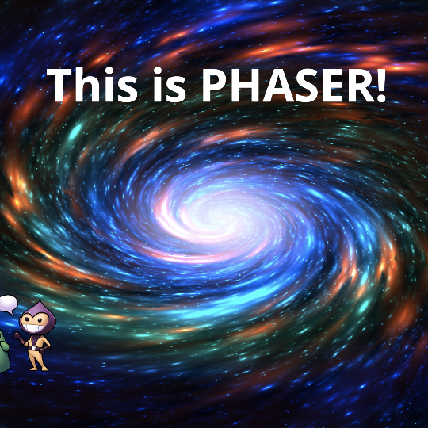

### Hello Universe, I'm J.D. Nicholls 👋

> Open Source Contributor, Full Stack Developer. Creator of [@proyecto26](https://github.com/proyecto26). I believe in Unicorns 🦄 Support [me](https://github.com/sponsors/jdnichollsc), if you do too.

  
<b>Quotes 📝</b>

- 🌱 To be, or not to be, that's not the dilemma... Let it be!
- 🌌 The universe is order from chaos, a beautiful contradiction
- 🌎 Our comfort zone is the Earth
- 🐛 Anyone who doesn't use GitHub for inspiration is doomed to repeat the same mistakes
- 🥟 Something better than empanadas? The tickles
- 👯 Blood makes us relatives but our feelings make us a Family
- 💬 You cannot help someone who doesn't want to be helped
- 🏫 A world that doesn't care about the education of people, so people don't care about the world...
- 🧠 You are not wise because of the amount of things you say, but because of the amount of things that you keep quiet
- 🤔 When you think that the world is a lonely place, remember that you will always have yourself and it is really the only thing you need to be happy
- 🙏 Muchas personas han pasado por mi vida al tratar de encontrar algo especial afuera, y realmente me alegra porque me han permitido darme cuenta lo especial que soy, de que soy alguien que ve lo que otros no, y no tengo que vivir al modo que otros quieran, sino al que me haga realmente feliz, vivir para mi... así que vive tu vida y sé feliz, porque no tienes que ajustarte a nadie más que a ti mismo!
- 🔭 Para otros los errores de uno pueden parecer estúpidos, y más porque la mayoría juzga con lo que ve a primera vista, pero no hay diamante perfecto que se haya hecho sin tenerse que haber pulido bastante primero, es por eso que cagarla es bueno si aprendes de tus errores de manera temprana, si forjas unas bases solidas para luego crecer hasta donde te lo propongas, porque en cambio hay gente en la vida que cree que lo ha hecho todo perfecto, a su modo, que sus acciones no contemplan errores, y la mayoría no llegan a tener un gran propósito e impacto en la vida de otros. Aveces tienes que ser ese ejemplo, el que más ha sufrido, el que más ha caído pero que te has levantado de nuevo con la ayuda de Dios, para ser quien le enseñe a todos algo que no habían visto, sin soberbia y con la humildad de saber todo lo que te costó para llegar a donde te encuentras... así que mira con otros ojos, no te deprimas por el ahora que es temporal, concentra tus ojos en el futuro porque para eso tienes tiempo, para descubrir hasta donde podrás llegar y el impacto que tendrás en la vida de los demás, porque al final somos una pequeña luz en toda este basta oscuridad llamada Universo.

  
<b>Open Talks 🎬</b>

  
  
  
  
  
  
  
  
  
  
  
  
  
  
  

  
<b>Other resources 🍬</b>

  
  - [The Job Interview Guide](https://gist.github.com/jdnichollsc/b9bedff406b54c3ae2cd651512683b51).
  - [ALM (Application lifecycle management)](https://1drv.ms/p/s!AuuT0nlcIqEUyBqk3-ueD4-0z2do).
  - [Creación de aplicaciones Web utilizando las últimas tecnologías con ASP.NET](https://1drv.ms/p/s!AuuT0nlcIqEUzxmAd40bYha56FV3).
  - [Aplicaciones en Facebook con ASP.NET MVC, Entity Framework y Facebook SDK](https://1drv.ms/p/s!AuuT0nlcIqEUjRi32ZZvlOpHE_B-).

### Social Change
Looking for a social change? Do you want to change the world? Give us a hand, Join [us](https://github.com/proyecto26/social-change)! ✋

### Made with `<3`
One hand can accomplish great things, but many can take you into space and beyond! 🌌

Together we do more, together we are more ❤️
<!--
**jdnichollsc/jdnichollsc** is a ✨ _special_ ✨ repository because its `README.md` (this file) appears on your GitHub profile.

Here are some ideas to get you started:

- 🔭 I’m currently working on ...
- 🌱 I’m currently learning ...
- 👯 I’m looking to collaborate on ...
- 🤔 I’m looking for help with ...
- 💬 Ask me about ...
- 📫 How to reach me: ...
- 😄 Pronouns: ...
- ⚡ Fun fact: ...
-->

