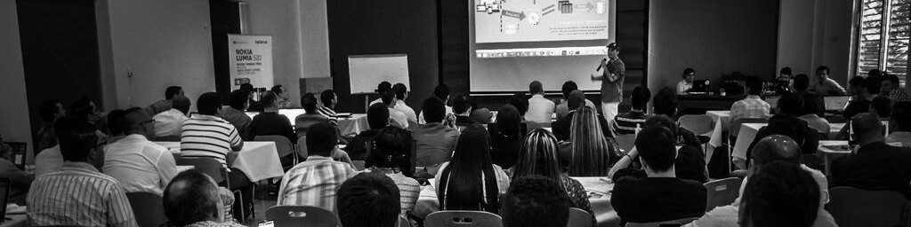

### Hi there, I'm J.D. Nicholls 👋

> Open Source Contributor, Full Stack Developer. Creator of [@proyecto26](https://github.com/proyecto26). I believe in Unicorns 🦄 Support [me](https://github.com/sponsors/jdnichollsc), if you do too.

<!--
**jdnichollsc/jdnichollsc** is a ✨ _special_ ✨ repository because its `README.md` (this file) appears on your GitHub profile.

Here are some ideas to get you started:

- 🔭 I’m currently working on ...
- 🌱 I’m currently learning ...
- 👯 I’m looking to collaborate on ...
- 🤔 I’m looking for help with ...
- 💬 Ask me about ...
- 📫 How to reach me: ...
- 😄 Pronouns: ...
- ⚡ Fun fact: ...
-->
